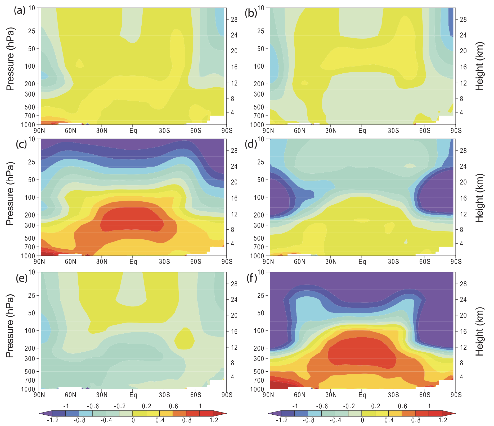
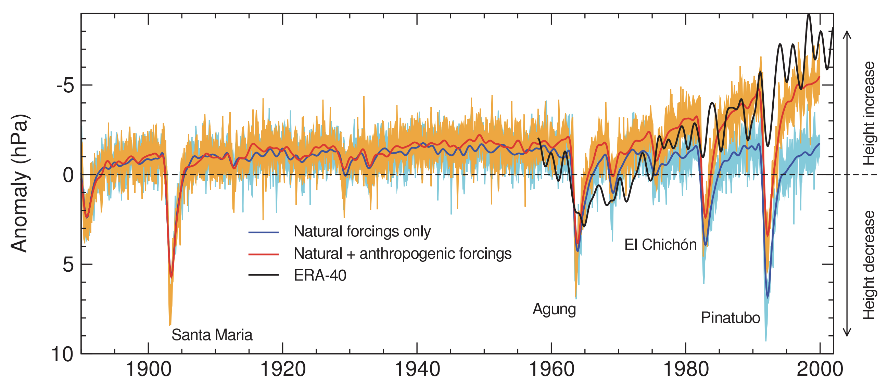
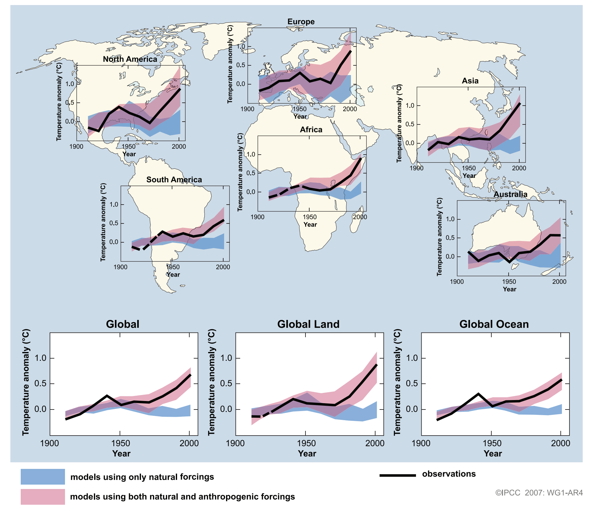
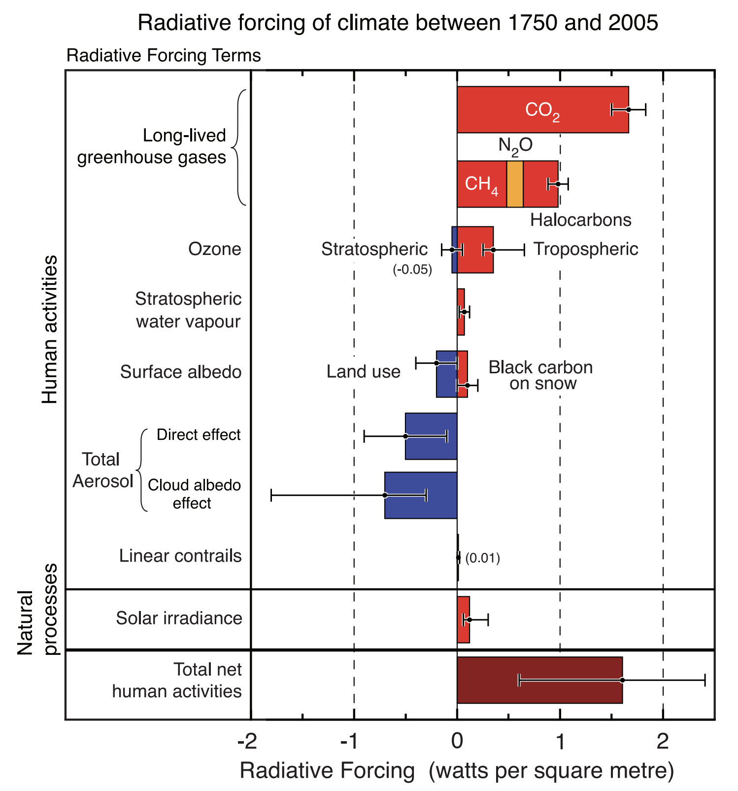
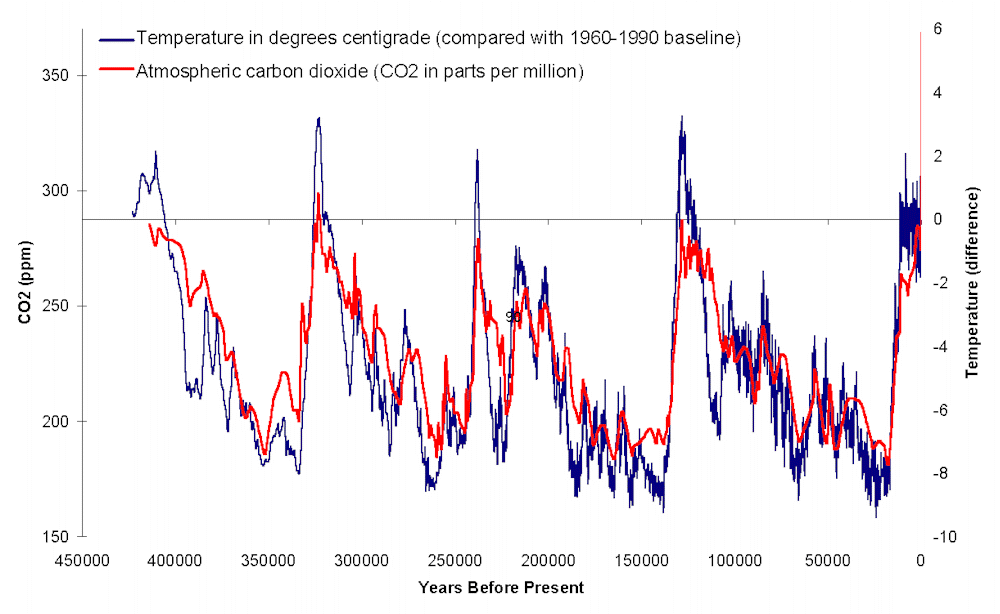
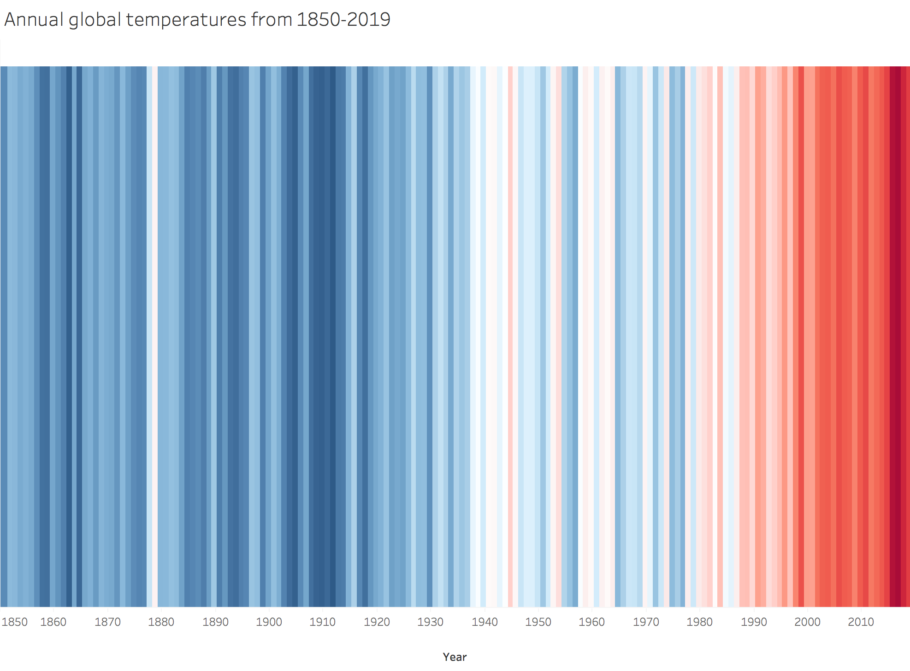

# Data Visualization Evaluations   Climate Change Caused by Human Activity
A project on evaluating data visualizations of climate change caused by human activity and replicating visualization

## Evaluations for Visualizations
In the first part of this project, I explored data visualiztions arguing whether climate change is caused by human activity and evaluated the visualizations using the following framework developed from this [article](http://water.engr.psu.edu/wagener/PublicationsPDFs/EMS2011%20Kelleher%20and%20Wagener.pdf).

### Evaluation Framework:
1. **Graph Simplicity** - Create the simplest graph that conveys the information you want to convey
2. **Use the Right Plot** - Consider the type of encoding object and attribute used to create a plot
3. **Plot Focus** - Focus on visualizing patterns or on visualizing details, depending on the purpose of the plot
4. **Meaningful Axis Ranges** - Selecting a range for the vertical axis depends on a graph’s purpose and type.
5. **Aggregate Larger Datasets in Meaningful Ways** - Large quantitative datasets can be simplified via summary plots.
6. **Appropriate Color** - Select an appropriate color scheme based on the type of data

 

### Argument: Climate change _is_ caused by human activity

### Visualization 1. 

>Zonal mean atmospheric temperature change from 1890 to 1999 (°C per century) as simulated by the PCM model from (a) solar forcing, (b) volcanoes, (c) well mixed greenhouse gases, (d) tropospheric and stratospheric ozone changes, (e) direct sulphate aerosol forcing and (f) the sum of all forcings. Plot is from 1,000 hPa to 10 hPa (shown on left scale) and from 0 km to 30 km (shown on right). Based on Santer et al. (2003a).

[Image Source](https://www.ipcc.ch/site/assets/uploads/2018/02/ar4-wg1-chapter9-1.pdf)

**Chart: Heat Map**

Criteria | Evaluation
-------- | ----------
Graph Simplicity | This visualization is simple and clear. It uses color and three axis to make an argument for anthropogenic climate change, conveying the spatial patterns of the response to different forcings, without throwing too much information at once.
Use the Right Plot |	Heat map is a good choice here as it can chart varying temperatures at different zone, and pressure and height. Comparing charts of different forcings also support the argument clearly. 
Plot Focus |	Since this visualization is focusing on searching patterns, heat map can be effective even though extracting actual differences between values is difficult.
Meaningful Axis Ranges |	The graphs set the limits of the axis as close as possible to the magnitude of the dataset range, and the charts don’t have any wasted space.
Aggregate Larger Datasets in Meaningful Ways |	The graphs show the mean atmospheric temperature change from 1890 to 1999. Since the main focus is to show that climate change is mostly caused by greenhouse gases, we only need the aggregate mean but not the mean of every single year.
Appropriate Color |	The diverging color scheme used here highlights the contrasts between low and high temperature change relative to constant temperature. The obvious difference between the graph of greenhouse gases and the others further support the purpose of the graph. 

 

### Visualization 2. 

>Comparison between reanalysis and climate-model simulated global monthly mean anomalies in tropopause height. Model results are from two different PCM ensemble experiments using either natural forcings, or natural and anthropogenic forcings (ALL). There are four realizations of each experiment. Both the low-pass filtered ensemble mean and the unfiltered range between the highest and lowest values of the realizations are shown. All model anomalies are defined relative to climatological monthly means computed over 1890 to 1999. Reanalysis-based tropopause height anomalies estimated from ERA-40 were filtered in the same way as model data. The ERA-40 record spans 1957 to 2002 and was forced to have the same mean as ALL over 1960 to 1999. After Santer et al. (2003a) and Santer et al. (2004).

[Image Source](https://www.ipcc.ch/site/assets/uploads/2018/02/ar4-wg1-chapter9-1.pdf)

**Chart: Multi-line Chart**

Criteria | Evaluation
-------- | ----------
Graph Simplicity | This visualization is not very simple. There are multiple lines showing different situations of both aggregated and not aggregated data. 
Use the Right Plot |	It is clear to show the climate change trend by using line chart, and including lines of difference causes serves the purpose of supporting the argument. The data values that the positions represent and the value comparisons are easily determined. 
Plot Focus |	This visualization is focusing on showing patterns, which is the trend of climate change comparing natural and natural + anthropogenic forcings. Line chart can be effective for this purpose even though extracting actual differences between values might be hard.
Meaningful Axis Ranges |	The graphs set the limits of the axis as close as possible to the magnitude of the dataset range to reduce the wasted space. Since the graph is to show the anomaly, it makes it very clear to include zero on the vertical axis, especially putting zero in the middle.
Aggregate Larger Datasets in Meaningful Ways |	For long time-series, temporal aggregation like this case, averaging the monthly anomalies across a larger time step can be used to reduce the number of data points. Though this graph still shows a lot of the data points, I think the reason to do so is to give a stronger visual impression.
Appropriate Color |	The two categories the visualization is trying to compare is well represented with qualitative schemes that are made up of contrasting colors (orange vs. light blue; red vs. blue) that show differences clearly and intuitively. 

 

### Visualization 3. 

>Temperature changes relative to the corresponding average for 1901-1950 (°C) from decade to decade from 1906 to 2005 over the Earth’s continents, as well as the entire globe, global land area and the global ocean (lower graphs). The black line indicates observed temperature change, while the colored bands show the combined range covered by 90% of recent model simulations. Red indicates simulations that include natural and human factors, while blue indicates simulations that include only natural factors. Dashed black lines indicate decades and continental regions for which there are substantially fewer observations. 

[Image Source](https://www.ipcc.ch/site/assets/uploads/2018/02/ar4-wg1-chapter9-1.pdf)

**Chart: Multi-line Chart on Map**

Criteria | Evaluation
-------- | ----------
Graph Simplicity | This visualization is not the simplest, but considering the amount of information it gives, it is still relatively simple and conveys the information it wants to convey clearly. 
Use the Right Plot |	It is a great way to put the line charts of temperature change over the Earth’s continents on the map, so the audience can better relate the different charts to the geographical location. The line charts show the trend and the comparison between the two causes clearly and beautifully.  
Plot Focus |	This visualization is focusing on showing patterns, which is the trend of climate change comparing natural and natural + anthropogenic forcings, over the Earth’s continents. Line chart can be effective for this purpose even though extracting actual differences between values might be hard. The pattern differences among continents are also straightforwardly displayed.
Meaningful Axis Ranges |	The graphs set the limits of the axis as close as possible to the magnitude of the dataset range to reduce the wasted space. It is consistent that all the charts have the same axis ranges. The vertical axis does not begin at zero like most of the graphs, but it makes sense for this data and the purpose of the graphs to not begin at zero.
Aggregate Larger Datasets in Meaningful Ways |	For long time-series, temporal aggregation like this case, averaging the monthly anomalies across a larger time step can be used to reduce the number of data points.
Appropriate Color |	The two categories the visualization is trying to compare is well represented with qualitative schemes that are made up of contrasting colors (red vs. blue) that show differences clearly and intuitively. The transparency of the lines makes it clear to see all the lines. 

 

### Visualization 4. 

>Summary of the principal components of the radiative forcing of climate change. Human activities cause significant changes in long-lived gases, ozone, water vapor, surface albedo, aerosols and contrails. The only increase in natural forcing of any significance between 1750 and 2005 occurred in solar irradiance. Positive forcings lead to warming of climate and negative forcings lead to a cooling. The thin black line attached to each colored bar represents the range of uncertainty for the respective value.  

[Image Source](https://www.ipcc.ch/site/assets/uploads/2018/02/ar4-wg1-chapter2-1.pdf)

**Chart: Horizontal Bar Chart with Error Bar**

Criteria | Evaluation
-------- | ----------
Graph Simplicity | This visualization is simple and intuitive. Both length and position are can be easily quantitatively perceived in a bar chart. It supports the argument without providing unnecessary information.  It uses contrast colors to emphasize the negative and positive radiative forcing of factors affected by human activities.
Use the Right Plot |	Both length and position are can be easily, quantitatively perceived in a bar chart. The thin black line attached to each colored bar clearly represents the range of uncertainty for the respective value.  
Plot Focus |	The purpose of the plot is to support the argument that climate change is caused by human activity by showing human activities are causing more radiative forcing than natural processes. This visualization displays details, which are the exact values of radiative forcing cause by different factors, in a very clear way. 
Meaningful Axis Ranges |	The plot includes only the needed range on X-axis (-2 to 2). It is meaningful and has the minimal amount of wasted space. 
Aggregate Larger Datasets in Meaningful Ways |	The plot shows the change of the values represent the forcings in 2005 from the start of the industrial era, instead of showing the value of every year. It is very clear and straightforward for presenting the idea it wants to convey, but sacrifices the data resolution.
Appropriate Color |	Using red for positive forcings that lead to warming of climate and blue for negative forcings that lead to a cooling is intuitive help make a deeper impression on the audience, instead of just using one color for all the values of the components. 

 

### Argument: Climate change _is NOT_ caused by human activity

### Visualization 5. 

>Over the past few hundred thousand years of ice core data, a “medium” time scale in this sense, CO2 superficially appears to change in step with temperature if a graph is so zoomed out as to not show sub-millennial time scales well. 

[Image Source](https://wattsupwiththat.com/2012/04/11/does-co2-correlate-with-temperature-history-a-look-at-multiple-timescales-in-the-context-of-the-shakun-et-al-paper/)

**Chart: Dual Axis Multi-line Chart**

Criteria | Evaluation
-------- | ----------
Graph Simplicity | This visualization is straightforward, using contrast colored lines to show the long term trend of the relationship between CO2 and temperature.
Use the Right Plot |	It is clear to show both the CO2 and temperature change overtime by using line chart. Since CO2 level and temperature have different numerical units, it is clear to show the values of the two variables using dual axis. 
Plot Focus |	This visualization is focusing on comparing the long term patterns of CO2 and temperature changes. Line chart is effective for this purpose. Though extracting actual differences between values might be hard, but this is not the focus of this graph.
Meaningful Axis Ranges |	The graphs set the limits of all the axis as close as possible to the magnitude of the dataset range to reduce the wasted space. The graph is to show the degree of climate change, so setting zero in the middle of the vertical axis on the right makes it clear and intuitive and provides the full picture of the overall changes. 
Aggregate Larger Datasets in Meaningful Ways |	For long time-series, especially looking back to the history like this case, showing the aggregated value on the plot across a larger time step make it possible to show the longest timescales without making it difficult to read.
Appropriate Color |	The contrasting colors of the two lines express the relationship clearly and help support the argument against that climate change is caused by human activity in the relatively short timescales and longest timescales. 

 

### Conclusion

Of all 5 visualizations, Visualization 2 conveys the argument most intuitively and clearly. The color usage gives a stronger visual impression. It is beautiful and did a good job in making an argument. Visualization 1 and 3 are special and visually appealing, which is a good way to hook the audience. The transparency of the colors used in both the visualizations are more appealing to eye comparing to using strong colors, while not losing its purpose of supporting the argument. Visualization 4 and 5 are use basic yet powerful contrasting colors to convey the ideas. They are not as engaging as the other three, but they did a great job in using the simplest graph that conveys the information they want to convey. 

 
 

## Replicating Visualization: Warming Stripes
In the second part of this project, I replicate a visualization of climate change using this [data](https://www.metoffice.gov.uk/hadobs/hadcrut4/data/current/download.html).
 

 
 

## References
### Evaluation Framework
* Kelleher, C., Wagener, T., Ten guidelines for effective data visualization in scientific publications, Environmental Modelling & Software ([2011](http://water.engr.psu.edu/wagener/PublicationsPDFs/EMS2011%20Kelleher%20and%20Wagener.pdf)), doi:10.1016/j.envsoft.2010.12.006

### Visualizations
* Hegerl, G.C., F. W. Zwiers, P. Braconnot, N.P. Gillett, Y. Luo, J.A. Marengo Orsini, N. Nicholls, J.E. Penner and P.A. Stott, [2007](https://www.ipcc.ch/site/assets/uploads/2018/02/ar4-wg1-chapter9-1.pdf): Understanding and Attributing Climate Change. In: Climate Change 2007: The Physical Science Basis. Contribution of Working Group I to the Fourth Assessment Report of the Intergovernmental Panel on Climate Change [Solomon, S., D. Qin, M. Manning, Z. Chen, M. Marquis, K.B. Averyt, M. Tignor and H.L. Miller (eds.)]. Cambridge University Press, Cambridge, United Kingdom and New York, NY, USA.
* Forster, P., V. Ramaswamy, P. Artaxo, T. Berntsen, R. Betts, D.W. Fahey, J. Haywood, J. Lean, D.C. Lowe, G. Myhre, J. Nganga, R. Prinn, G. Raga, M. Schulz and R. Van Dorland, [2007](https://www.ipcc.ch/site/assets/uploads/2018/02/ar4-wg1-chapter2-1.pdf): Changes in Atmospheric Constituents and in Radiative Forcing. In: Climate Change 2007: The Physical Science Basis. Contribution of Working Group I to the Fourth Assessment Report of the Intergovernmental Panel on Climate Change [Solomon, S., D. Qin, M. Manning, Z. Chen, M. Marquis, K.B. Averyt, M.Tignor and H.L. Miller (eds.)]. Cambridge University Press, Cambridge, United Kingdom and New York, NY, USA.
* Does CO2 correlate with temperature history? – A look at multiple timescales in the context of the Shakun et al. paper; Anthony Watts, [2012](https://wattsupwiththat.com/2012/04/11/does-co2-correlate-with-temperature-history-a-look-at-multiple-timescales-in-the-context-of-the-shakun-et-al-paper/)
